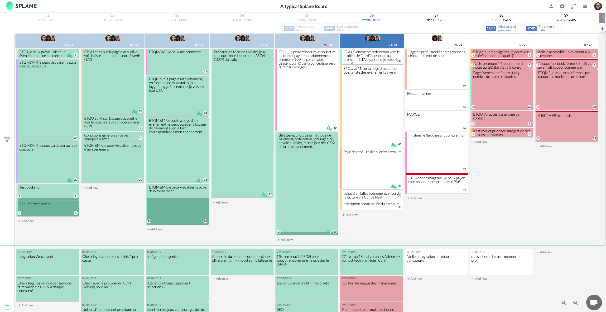

# How I ruined my application performances by using React context instead of Redux

## TL;DR

- I used React contexts instead of Redux for centralized states
- Without a selector system, my components where getting lots of data as props, some of them were often changing and not necessary to build the view
- Any change in these contexts objects caused almost all my components to rerender
- I had thousands of useless rerenders at every user interraction
- Refactor all the application to use Redux and use wisely the selector system to give each component strictly what it needed solved the problem
- Before choosing between contexts or redux, think about the optimizations the selector system can bring you

## A bit of context

At Theodo, we heavily use Scrum, which is great to manage a backlog sprint after sprint. But many of our projects had hard times maintaining a clear and evolutive release plan. We especialy had problems making visible the dependencies each of our EPICs had to external teams or services.

So, we decided to develop a tool to address those problems: [Splane](http://splane.io).



As you can see, this is a trello-like Kanban board where each columns represents a sprint. The idea is that you have two distinct zones: the top one to organise your EPICs and to bottom one to manage your dependencies.

I chose React to develop the frontend part, but I made a big architectural mistake at the very begining of the project.

## Why I choosed to get rid of Redux and how I replaced it

We've been using Redux on all our React projects for a long time, and Redux is part of our React boilerplate. But I've always found that Redux was quite a heavy and verbose system with all its reducers, action creators and selectors. And, on top of that, at that time, our boilerplate included Flow typing (we've moved to Typescript since), which made the whole thing even more verbose.

So, when the application needed its first centralized state, I told myself "Let's make it much simpler, let's use React context instead of Redux".

To make this new context based architecture easy to use, I developped the following HOC:

```javascript
import React, { useContext, useState } from 'react';
import { getDisplayName } from 'recompose';

export const provideContext = (
  Context, // The context object the state will be saved in
  name, // The state name
  setterMethodName, // The state setter name
  defaultValue = null, // The state default value
) => WrappedComponent => {
  const ComponentWithContext = props => {
    const [state, setState] = useState({
      [name]: typeof defaultValue === 'function' ? defaultValue(props) : defaultValue,
      [setterMethodName]: setContext,
    });

    function setContext(value) {
      setState({
        ...state,
        [name]: value,
      });
    }

    return (
      <Context.Provider value={state}>
        <WrappedComponent {...{ ...props, ...state }} />
      </Context.Provider>
    );
  };

  ComponentWithContext.displayName = `provideContext(${getDisplayName(WrappedComponent)})`;

  return ComponentWithContext;
};

export const withContext = Context => WrappedComponent => {
  const ComponentWithContext = props => {
    const context = useContext(Context);
    return <WrappedComponent {...{ ...props, ...context }} />;
  };

  ComponentWithContext.displayName = `withContext(${getDisplayName(WrappedComponent)})`;

  return ComponentWithContext;
};

export default withContext;
```

As you can see, all I had to do after that was to wrap a parent component with `provideContext` and then inject the state and the state setter to my children components with `withContext` :

```javascript

// MyParentComponent.js
const MyParentComponent = () => (<div>
    <MyChildComponent />
</div>)

export default provideContext(CurrentUserContext, 'currentUser', 'setCurrentUser', { username: 'Obi-Wan Kenobi' })(MyParentComponent);

// MyChildComponent.js
const MyChildComponent = ({ currentUser, setCurrentUser }) => (<div>
    <span class="username">{currentUser.username}</span>
    <button onClick={() => setCurrentUser({ ...currentUser, username: 'Yoda' })}>Become Yoda</button>
</div>)

export default withContext(CurrentUserContext)(MyChildComponent);
```

Not perfect, but it was simpler than Redux. During the first few month of the project, I was quite happy with this system.

## Why it was a mistake

The application growed, as most of them do. And the performances degraded slowly. At one point, we wanted to develop a feature so the user could link an EPIC to its dependencies, and when he hovered the EPIC card, the link would appear. So, we developped the feature using the context system, and this happened:


The application was incredibly slow. After a few investigations, we found out (partly thanks to why-did-you-update) that each user interraction caused thousands of useless rerenders. Every time the user hovered an EPIC card, almost every other EPICs and dependicies were rerendering several times.

So, what cause this huge amount of rerenders ?

To display the link between an EPIC and its dependencies, I had created a context to store (for exemple) the current hovered card. So in my EPICs and dependencies component, I had something like this:

```javascript

// Board.js
export default provideContext(CurrentCardContext, 'currentCard', 'setCurrentCard', null)(Board); // Board is the parent component of all the EPICs and dependencies

// Epic.js
const Epic = (epic, currentCard, setCurrentCard) => (
  <div
    class={epic.id === currentCard.id ? 'hover' : ''}
    onMouseOver={() => {
      setCurrentCard({
        id: epic.id,
        type: EPIC_CARD_TYPE,
      });
    }}
    onMouseOut={() => {
      setCurrentCard(null);
    }}
  />
);

export default withContext(CurrentCardContext)(Epic);
```

Of course, this exemple is a huge simplification of my actual component. In fact, I injected 5 different contexts inside the epic component and I did other operation in `onMouseOver` and `onMouseOut`.

But, this simple exemple shows the problem: each time I hover an EPIC or a dependency, ALL the EPICs and the dependencies rerender because the `currentCard` value changes and ALL the EPICs and dependencies take it as a prop. This leads to hundreds of useless rerenders when, in fact, I could only rerender two cards (the previous hovered card and the current hovered card). I let you imagine what this can lead to when you have a huge board and the current card data is not the only one provoking useless rerenders. The performances were mediocre.

## What I had to do to fix everything

Well, I needed a selector system. Why ? To inject into the components only the data they need, and move the computation/transformation of such data outside of the rendering cycle. Basically, my choices were to code a selector system on top of my contexts, hence recoding a big part of Redux, or use Redux itself. Of course, I chose Redux and did this:

```javascript
// Epic.js
const Epic = (epic, isHovered, setCurrentCard) => (
  <div
    class={isHovered ? 'hover' : ''}
    onMouseOver={() => {
      setCurrentCard({
        id: epic.id,
        type: EPIC_CARD_TYPE,
      });
    }}
    onMouseOut={() => {
      setCurrentCard(null);
    }}
  />
);

const mapStateToProps = (state, props) => ({
  isHovered: state.currentCard && state.currentCard.id === props.epic.id,
});

const mapDispatchToProps = dispatch => ({
  setCurrentCard: currentCard => dispatch(currentCardActions.setCurrentCard({ currentCard })),
});

export default connect(
  mapStateToProps,
  mapDispatchToProps,
)(Epic);
```

Here, the computation of isHovered is not done during the render, but in the Redux lifecycle, which is way less costly. And with this trick, when hovering an EPIC or a dependency, only this card and the previously hovered one will rerender. By appliying this principle to all the centralized states everywhere in the application, the time it took to display the link between two card droped from 1500ms to 100ms.

## Conclusion

Yes, the title is a clickbait. Contexts are not bad, and Redux should not be used whenever you need a centralized state. But before choosing one of them, think about the optimizations the selector system and the Redux lifecycle can bring you. In my opinion, contexts should be used for simple data that do not change often, and when it gets more complicated than that, you should go for Redux.

## One last thing

If you'd like to try [Splane](http://splane.io), feel free to do so. It's free and open to everyone ;)